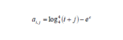
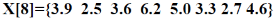
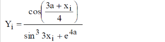

# Sixth laboratory work on the subject "Visual software development tools"
## Project on c++/Qt(Qt Quick)/CMake

## Task 1

Find row with max sum of items in matrix 6X5. Calculate product of non-zero items.
Each item of matrix calculates by given formula.

## Task 2

Check each pixel of selected image and set it lightness in HSL-model
to 255 if lightness is greater than max value, 0 if less than min value.
Min- and max-value of lightness enter by user.

## Task 3

Build matrix of random numbers, width and height enter by user.
Generate array, each item is a product of even items of column of matrix.

## Task 4

Create static array of 8 real numbers.

Calculate new array, each item calculates by given formula.

